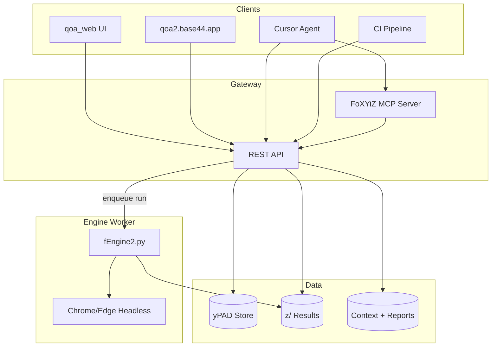

# PRD — QAonAIR BRAHL Web (`qoa_web`)

**Version:** 0.1  
**Date:** 2026-07-03  
**Author:** QAonAIR / FoXYiZ team  
**Status:** Draft — desktop-first research & build

---

## 1. Summary

Build the **BRAHL lifecycle as a web application** so customers and consultants can run **Build → Run → Analyze → Heal → Loop → Verify → Report** in the browser — not only on a developer desktop via `BRAHL.py`.

Today, [qoa2.base44.app](https://qoa2.base44.app/) already exposes BRAHL **product pages** (Build, Heal, Loop, marketplace, avatars), but **FoXYiZ does not execute in the cloud version**. Runs still depend on a local install (`python f/fEngine2.py`, `Foxyiz2.exe`, or `BRAHL.py`). This PRD defines how to close that gap: **develop and test on desktop with Cursor**, then **deploy a web front-end + API + engine worker** that works in cloud.

Secondary goal: expose FoXYiZ through **MCP tools** and **REST APIs** so Cursor agents, CI, and third-party apps (including qoa2) can trigger runs, read `z/` results, and participate in BRAHL cycles without the desktop GUI.

---

## 2. Problem statement

### What works today

| Layer | Status |
|-------|--------|
| **FoXYiZ engine** | Stable locally — `fEngine2.py`, yPAD CSVs, `z/` artifacts, BRAHL reports |
| **BRAHL desktop** | `BRAHL.py` mirrors `Docs/BRAHL.md` — multi-suite, Loop 1–3, Verify, context JSON, reports |
| **qoa2 product UI** | Base44 app — landing, BRAHL pages, Jobs/Social assistants, four avatars |
| **qoa2 yPAD suite** | `y/qoa2/` — ~81 plans including BRAHL navigation, Issue plans (`/run`, `/analyze` 404) |
| **Agent workflows** | Cursor + Playwright MCP for explore; agents edit yPAD and run engine locally |

### What is broken / missing

| Gap | Impact |
|-----|--------|
| **No cloud engine** | qoa2 “Run” cannot invoke `fEngine2` on Base44 infrastructure |
| **No API bridge** | Product UI and FoXYiZ are disconnected — no job queue, no run status, no `z/` sync |
| **yPAD lives in repo** | Suites are files under `KK/y/` — not loaded into qoa2 backend |
| **Results not in product** | `zDash`, `_errors.csv`, `brahl_report.md` stay on the machine that ran tests |
| **MCP not productized** | Agents use filesystem + shell; no stable `foxyiz_*` MCP server for customers |

### User story (customer)

> As a **client on QAonAIR**, I open Build, upload my app URL and requirements, run a BRAHL cycle, see failures and A1 defects in Analyze, and share a report with my dev team — **without installing Python or FoXYiZ locally**.

### User story (internal / Cursor)

> As a **builder using Cursor**, I develop `qoa_web` locally, point it at the same REST/MCP API the cloud uses, run IVVU/qoa2 suites, and deploy when parity with `BRAHL.py` is proven.

---

## 3. Goals & non-goals

### Goals

1. **Web BRAHL** — Five phases (+ Verify + Report) in browser, aligned with `Docs/BRAHL.md`.
2. **Engine in cloud** — Headless Selenium runs via a **dedicated worker** (not Base44 edge-only).
3. **API + MCP** — Same capabilities for web UI, Cursor, CI, and qoa2.base44.app.
4. **Desktop-first dev** — Implement and test locally; deploy worker + API to cloud.
5. **YPAD as contract** — Upload/edit plans; store versioned; exportable (moat from `QoA_Comps.md`).
6. **Context at Step 0** — User prompt + **uploaded documents** (specs, route maps) → `brahl_context_*.json`.

### Non-goals (v0.1)

- Replacing Base44/qoa2 entirely in one release.
- Running Selenium **inside** Base44 serverless functions (not viable — see [RESEARCH.md](./RESEARCH.md)).
- LLM auto-heal in cloud (`fEngine.py --heal`) — optional later; v0.1 focuses on run + analyze + report.
- Full marketplace/payments (remain in qoa2; `qoa_web` integrates via API).

---

## 4. Reference implementations

| Asset | Role for qoa_web |
|-------|------------------|
| `BRAHL.py` | UX blueprint — tabs, fStart picker, Loop steps, shrink/restore Run=Y, report generation |
| `f/fEngine2.py` | Run orchestration, `write_brahl_context`, `write_brahl_report`, `snapshot_ypad_plans` |
| `z/*_zDash.html` | Analyze dashboard pattern — embed or link from web Analyze tab |
| `Docs/BRAHL.md` | Authoritative cycle protocol and report template |
| qoa2.base44.app | Product shell — eventual embed or deep-link to `qoa_web` Run/Analyze |

---

## 5. Target architecture



### Component responsibilities

| Component | Responsibility |
|-----------|----------------|
| **qoa_web UI** | React/Next (TBD) — Build, Run, Analyze, Heal, Loop, Report; file upload for yPAD + context docs |
| **REST API** | Auth, projects, suites, run jobs, poll status, fetch zResults/zDash/report URLs |
| **MCP server** | Tools: `foxyiz_run`, `foxyiz_analyze`, `foxyiz_snapshot_plans`, `foxyiz_brahl_context`, `foxyiz_list_runs` |
| **Engine worker** | Long-running VM/container — Python 3, Chrome, `fEngine2.py`, writes to shared `z/` storage |
| **yPAD store** | S3/blob or DB — versioned CSVs + suite JSON per project |
| **Results store** | Run folders mirroring local `z/<timestamp>_<suite>/` |

### Deployment topology (recommended)

```
┌─────────────────────────────────────────────────────────┐
│  Cloud (AWS / GCP / Azure / Railway)                    │
│  ┌──────────────┐  ┌──────────────┐  ┌───────────────┐  │
│  │ qoa_web      │  │ API service  │  │ Worker pool   │  │
│  │ (static/SSR) │→ │ FastAPI/     │→ │ fEngine2 +    │  │
│  │              │  │ Node         │  │ Chrome headless│  │
│  └──────────────┘  └──────────────┘  └───────────────┘  │
│         ↑                  ↑                  ↑           │
│         └──────────────────┴──────────────────┘           │
│                    S3 / blob: yPAD + z/                   │
└─────────────────────────────────────────────────────────┘
         ↑ HTTPS                          ↑
   qoa2.base44.app                  Cursor MCP (local or remote)
   (iframe / API client)            (stdio or SSE to API)
```

**Base44 (qoa2)** remains the **marketplace shell**; **FoXYiZ execution** moves to a **worker you control**. qoa2 calls your API — it does not host Selenium.

---

## 6. FoXYiZ connection — API & MCP

### REST API (v0.1 surface)

| Method | Path | Description |
|--------|------|-------------|
| `POST` | `/v1/projects` | Create project (app URL, name) |
| `POST` | `/v1/projects/{id}/context` | Step 0 — prompt + document uploads → context JSON |
| `GET/PUT` | `/v1/projects/{id}/ypad/{file}` | Read/write yPlans, yActions, yDesigns |
| `POST` | `/v1/projects/{id}/runs` | Start run — body: `{ config, tags, step: "Loop 1" \| "Verify" }` |
| `GET` | `/v1/runs/{runId}` | Status, progress, pass/fail counts |
| `GET` | `/v1/runs/{runId}/results` | zResults CSV, errors, artifact list |
| `GET` | `/v1/runs/{runId}/dashboard` | zDash HTML URL or inline |
| `POST` | `/v1/runs/{runId}/report` | Generate BRAHL report markdown |
| `POST` | `/v1/projects/{id}/ypad/shrink` | Run=N on passes, Run=Y on failures (Loop 2 prep) |
| `POST` | `/v1/projects/{id}/ypad/restore` | Restore all Run=Y (Verify prep) |

### MCP tools (mirror API for agents)

| Tool | Maps to |
|------|---------|
| `foxyiz_brahl_context` | Step 0 — prompt, documents, baseline snapshot |
| `foxyiz_run` | Enqueue engine job with fStart-equivalent config |
| `foxyiz_run_status` | Poll run progress |
| `foxyiz_analyze` | Return failures + RCA hints (T1/T2/T3/A1) |
| `foxyiz_snapshot_ypad` | Baseline/endline plan counts |
| `foxyiz_write_report` | Write brahl_report to run folder + flat index |
| `foxyiz_list_runs` | List `z/` runs for project |

MCP server implementation: thin wrapper calling REST API (or shared Python module imported by both).

### qoa2 integration options

| Option | Effort | Notes |
|--------|--------|-------|
| **A. API client in Base44** | Medium | qoa2 Run button → `POST /runs`; Loop page polls status |
| **B. Embed qoa_web** | Lower | iframe `run.qoaonair.com` authenticated via SSO token |
| **C. Hybrid** | Recommended | Build/Heal/Loop UX in qoa2; Run/Analyze heavy UI in qoa_web embed |

---

## 7. Web app — feature map (BRAHL phases)

Parity with `BRAHL.py` and `Docs/BRAHL.md`:

| Phase | Web features |
|-------|----------------|
| **Build** | Suite editor or CSV upload; validate against `xCapa.csv`; checklist; link to yVisualizer export |
| **Run** | fStart config (tags, timeout, headless); suite picker; live log stream; progress bar |
| **Analyze** | Run list; failure table with T1/T2/T3/A1; open zDash; open BRAHL report |
| **Heal** | Edit yPAD in browser or download; shrink/restore Run=Y; heal notes |
| **Loop** | Step 0 prompt + **document upload**; Loop 1/2/3/Verify buttons; cycle history table |
| **Report** | Generate merged report template; customer action plan section; share link |

---

## 8. Development strategy — desktop first, then cloud

### Phase 0 — Research (current)

- Document cloud blockers → [RESEARCH.md](./RESEARCH.md)
- Spike: wrap `fEngine2.main()` in FastAPI `POST /runs` locally
- Spike: MCP tool that triggers local run and returns run folder path

### Phase 1 — Local stack (4–6 weeks)

```
KK/
  qoa_web/
    api/          # FastAPI — calls fEngine2, same process or subprocess
    web/          # Next.js or Vite+React — BRAHL tabs
    mcp/          # foxyiz-mcp — stdio server
```

**Exit criteria:**

- [ ] Local web UI runs qoa2 smoke (`fStart_smoke.json`) and shows zDash
- [ ] Step 0 saves context JSON with uploaded PDF path
- [ ] Cursor can `foxyiz_run` via MCP and read results
- [ ] Parity checklist vs `BRAHL.py` Loop 1 → Verify → Report

### Phase 2 — Worker + cloud storage (4–6 weeks)

- Docker image: Python + Chrome + `KK/f` + `KK/x` + `KK/y`
- Worker pulls job from queue (Redis/SQS), writes `z/` to S3
- API deployed (Railway, Fly.io, ECS, Cloud Run **with min instances**)
- qoa_web static front deployed (Vercel/CloudFront)

**Exit criteria:**

- [ ] Cloud run of ivvu smoke 5+ plans green headless
- [ ] qoa2 prototype page triggers cloud run via API key
- [ ] BRAHL report accessible via HTTPS URL

### Phase 3 — qoa2 product integration (4–8 weeks)

- Wire qoa2 Run/Loop to API
- Consultant “human check” webhook (from `QoA_Comps.md` Tier 1 #1)
- Public BRAHL report embed / badge

---

## 9. Cloud connection — research summary

Full analysis: [RESEARCH.md](./RESEARCH.md).

**Root cause:** Base44 apps are optimized for **CRUD + UI**, not **long-running browser automation**. FoXYiZ needs:

1. **Python runtime** with `fEngine2.py`, `xActions.py`, Selenium, Chrome/Edge
2. **Writable filesystem** for `z/` artifacts (or stream to object storage)
3. **Process lifetime** of minutes (full suite), not serverless seconds
4. **Headless browser** — already supported via `FOXYIZ_HEADLESS` and cloud auto-detect in `xActions.py`

**Conclusion:** Do not port the engine into Base44. Host a **FoXYiZ Worker Service** and connect qoa2 via **API/MCP**.

---

## 10. Data & security

| Concern | Approach |
|---------|----------|
| Credentials in yPAD | `yD_Secure.csv` encrypted at rest; never return in API GET without role |
| Customer app URLs | Stored per project; worker only navigates allowlisted domains |
| Run isolation | One browser session per job; temp profile; kill on timeout |
| API auth | JWT for web; API keys for qoa2/CI; OAuth later for marketplace |
| Document uploads | Virus scan + size cap; store in `Docs/uploads/{projectId}/` equivalent in blob |

---

## 11. Success metrics

| Metric | Target (Phase 2) |
|--------|------------------|
| Cloud smoke run | qoa2 or ivvu smoke **100% pass** headless |
| Time to first run | &lt; 5 min from project create (excluding queue) |
| API latency (status) | &lt; 500 ms |
| BRAHL report | Generated for every Verify run |
| MCP | Cursor agent completes Loop 1 + Analyze without shell |

---

## 12. Risks & mitigations

| Risk | Mitigation |
|------|------------|
| Chrome flaky in container | Pin image; `--no-sandbox`; reuse `xActions` cloud detection |
| Base44 cannot call external API | CORS + API key; fallback embed qoa_web |
| yPAD edit conflicts | Versioning + optimistic lock |
| Cost of always-on worker | Queue + scale-to-zero with cold-start warning; smoke tier shared pool |
| qoa2 / qoa_web UX drift | Single API contract; shared BRAHL.md template |

---

## 13. Open questions

1. **Host qoa_web under** `app.qoaonair.com` vs embed only in qoa2?
2. **Multi-tenant yPAD** — one repo per customer or shared templates?
3. **Exe vs Python** in worker — Python only for v0.1; ship `Foxyiz2.exe` only for Windows CI?
4. **Real-time logs** — WebSocket vs poll (match `BRAHL.py` queue pattern)?
5. **Base44 backend** — can it store API keys and proxy runs, or must UI call FoXYiZ API directly from browser?

---

## 14. Immediate next steps

1. **Review this PRD** with team — confirm worker-on-AWS vs Railway vs Fly.
2. **Spike `qoa_web/api`** — FastAPI wrapper around `fEngine2` subprocess (local).
3. **Spike `qoa_web/mcp`** — one tool `foxyiz_run` calling local API.
4. **Minimal web** — Run tab only: pick suite, start, show log + link to zDash.
5. **qoa2 API proof** — one Base44 function that `POST`s to local tunnel (ngrok) to prove connectivity.
6. **Update `Docs/BRAHL.md`** — link to qoa_web PRD for web/MCP path (optional cross-ref).

---

## 15. Appendix — file layout (target)

```
KK/qoa_web/
  README.md
  PRD.md                 ← this document
  RESEARCH.md            ← cloud gap analysis
  api/
    main.py              # FastAPI entry
    runner.py            # subprocess fEngine2, stream stdout
    storage.py           # local z/ or S3 adapter
  web/
    package.json
    src/
      pages/             # build, run, analyze, heal, loop
  mcp/
    server.py            # MCP tool definitions
  docker/
    Dockerfile.worker    # Chrome + Python + KK mount
  docs/
    API.md               # OpenAPI notes (generated later)
```

---

*Related: [QoA_Comps.md](../Docs/QoA_Comps.md) · [BRAHL.md](../Docs/BRAHL.md) · [BRAHL.py](../BRAHL.py)*
